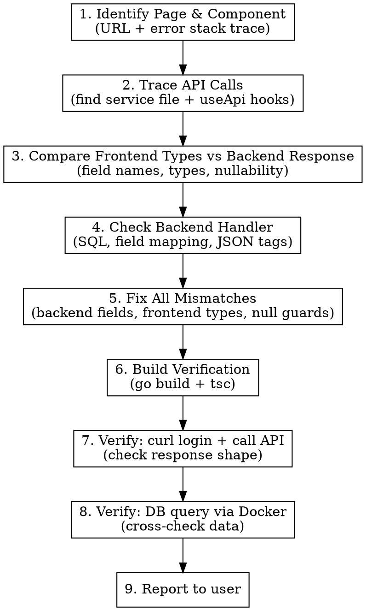

# Frontend Bug Trace

Full-stack bug tracing: Page -> Component -> API call -> Backend handler -> Database. Fix mismatches at every layer, then verify with real requests and DB queries.

## Workflow



## Step 1: Identify Page & Component

From the URL or error stack trace, locate the page component using **route files first** (not global search):

```
URL: /proxy/status
→ shellRouteConfig.tsx: path: 'proxy/status' → LazyPage: L.LazyProxyStatusCompliancePage
→ lazyPages.tsx: LazyProxyStatusCompliancePage → import('../pages/proxy/ProxyStatusCompliancePage')
→ Target: src/pages/proxy/ProxyStatusCompliancePage.tsx
```

**Actions (in order — stop at first hit):**
1. **Route config lookup** — `Grep` for the URL path segment (e.g. `proxy/status`) in `src/routes/shellRouteConfig.tsx`. This gives you the `LazyPage` component name.
2. **Lazy page mapping** — `Grep` for that `LazyPage` name in `src/routes/lazyPages.tsx`. This gives you the exact import path to the page component file.
3. **Read the page component** — follow the import path. If it's a wrapper (e.g. a tab container), read it to find the actual sub-component that renders the buggy UI.
4. **Stack trace shortcut** — if the user provided an error stack trace with a `file:line`, go directly to that file instead. Vite stack traces use `src/` paths directly.

**Do NOT** start with `Glob` for filename guesses — the route config is authoritative and faster.

## Step 2: Trace API Calls

Inside the page component, find ALL API calls:

```
Pattern 1: useApi(() => someApi.method(params), [...])
Pattern 2: useEffect + fetch/api.get
Pattern 3: useSWR / useQuery
```

**Actions:**
- Read the page component
- Identify every `useApi`, `fetch`, or API service call
- Follow the import to the API service file (e.g. `@/api/services/quotaAnalytics.ts`)
- Read the service file — note the **endpoint path**, **TypeScript interface**, and **HTTP method**

**Collect this mapping:**
```
Frontend Type Field    ->  API Endpoint           ->  Expected JSON field
entityName (string)    ->  GET /api/admin/xxx      ->  ???
usagePercent (number)  ->  GET /api/admin/xxx      ->  ???
```

## Step 3: Compare Frontend Types vs Backend Response

This is where most bugs live. Check for:

| Mismatch Type | Example |
|---------------|---------|
| **Field name** | Frontend: `entityName` / Backend: `targetId` |
| **Field missing** | Frontend expects `alertLevel`, backend doesn't return it |
| **Type mismatch** | Frontend: `number` / Backend: `string` or `null` |
| **Nullability** | Frontend calls `.toFixed()` on potentially `undefined` field |
| **Nesting** | Frontend: `data.items` / Backend: `data` (flat array) |
| **Query param name** | Frontend sends `period` / Backend reads `periodKey` |

**Actions:**
- Grep for the backend route registration matching the API path
- Read the Go handler — check the response struct's `json:"..."` tags
- Read the SQL query or DB method — what columns does it actually SELECT?
- Build a **field-by-field comparison table**

## Step 4: Check Backend Handler

For each API endpoint:

1. **Route registration** — `Grep` for the URL path in Go handler files
2. **Handler function** — Read the full handler
3. **Response struct** — Check `json:"..."` tags match what frontend expects
4. **Data source** — Does the handler resolve IDs to human-readable names? Or just return raw IDs?
5. **Query params** — Does the handler read the same param names the frontend sends?

**Common backend issues:**
- Returns raw UUID instead of display name (need to join/lookup)
- Missing fields the frontend expects (e.g. `alertLevel` not computed)
- JSON tag name differs from frontend TypeScript interface field name

## Step 5: Fix All Mismatches

Fix in this order:

1. **Backend response struct** — align `json:"..."` tags with frontend TypeScript types
2. **Backend logic** — add name resolution, computed fields, missing data
3. **Frontend types** — update TypeScript interfaces if backend field names change
4. **Frontend null guards** — add `?? 0`, `?? ''`, optional chaining for nullable fields
5. **Query param alignment** — ensure frontend sends what backend reads

## Step 6: Build Verification

```bash
# Go build — must pass before runtime verification
go build ./packages/control-plane/...

# TypeScript — check for type errors
cd packages/control-plane-ui && npx tsc --noEmit
```

Both must pass before proceeding to runtime verification.

## Step 7: Verify via Simulated Login + API Call

Use seed credentials to login and call the API. This verifies the **actual response shape**.

```bash
# Login (save cookie)
curl -s -c /tmp/nexus_cookie -X POST http://localhost:3001/api/admin/auth/login \
  -H 'Content-Type: application/json' \
  -d '{"email":"admin@nexus.ai","password":"admin123"}'

# Call the endpoint under test
curl -s -b /tmp/nexus_cookie "http://localhost:3001/api/admin/THE-ENDPOINT" | jq .
```

**Seed credentials (from `tools/db-migrate/seed/seed.ts` section 18):**

| Email | Password | Role |
|-------|----------|------|
| admin@nexus.ai | admin123 | super_admin |
| alice@nexus.ai | admin123 | admin |
| carol@nexus.ai | compliance123 | compliance |
| bob@nexus.ai | provider123 | provider_ops |
| diana@nexus.ai | viewer123 | viewer |

**Check the response:**
- Are all expected fields present?
- Are field names correct (camelCase matching frontend types)?
- Are values the right type (number vs string)?
- Are names resolved (not raw UUIDs)?

## Step 8: Verify via Database Query

Cross-check API response against the actual database to confirm data integrity:

```bash
# Query Postgres via Docker
docker exec $(docker ps --filter "name=postgres" -q | head -1) \
  psql -U postgres -d nexus_gateway -c "SELECT id, display_name, email FROM nexus_user LIMIT 5"
```

**What to verify:**
- Does the API response count match DB row count for the query?
- Do resolved names match what's in the DB?
- Are computed fields (percentages, alert levels) mathematically correct given raw DB values?
- Are there NULL values in DB columns that the frontend doesn't handle?

**Common DB checks by entity type:**

```sql
-- Users
SELECT id, display_name, email, status FROM nexus_user WHERE status='active';

-- Organizations
SELECT id, name, code, enabled FROM organization;

-- Virtual Keys
SELECT id, slug, enabled, budget_limit_usd FROM virtual_key;

-- Traffic/Cost data
SELECT * FROM metrics_rollup WHERE metric='estimated_cost_usd' ORDER BY created_at DESC LIMIT 10;
```

## Step 9: Report

Summarize to user:
- What mismatches were found (table format)
- What was fixed (backend / frontend / both)
- Verification results (API response sample + DB cross-check)

## Red Flags - Common Traps

| Trap | What to do |
|------|-----------|
| Frontend type says `string`, API returns `null` | Add `?? ''` or make field optional in TS |
| Frontend calls `.toFixed()` on API field | Guard with `?? 0` — field may be undefined/null |
| Frontend sends different query param name | Align: either fix frontend param or add backend alias |
| Backend returns ID, frontend expects name | Add DB lookup in backend handler (join or separate query) |
| API returns flat `data: []` but frontend expects `data: { items: [] }` | Check actual response shape, align types |
| Backend has no seed data for this entity | Run `cd tools/db-migrate && npx prisma db seed` first |
