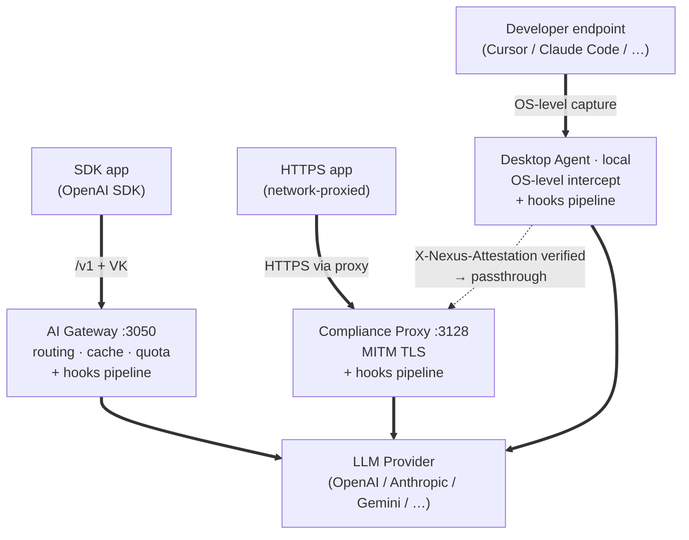

# Nexus Gateway

[](https://github.com/AlphaBitCore/nexus-gateway/actions/workflows/ci.yml)
[](https://github.com/AlphaBitCore/nexus-gateway/actions/workflows/go-ci.yml)
[](./scripts/check-go-coverage.sh)
[](./CHANGELOG.md)
[](./LICENSE)

> **Make AI safe to use across the enterprise.**

Nexus Gateway intercepts enterprise LLM traffic at three layers and runs all of it through one compliance engine, one audit pipeline, and one control plane.

| Mode | Where it intercepts | Code |
|---|---|---|
| 🔑 **AI Gateway** | SDK layer — virtual keys on `/v1/chat/*`, `/v1/responses`, `/v1/embeddings`, `/v1/messages` | `packages/ai-gateway/` |
| 🌐 **Compliance Proxy** | Network layer — transparent TLS bump (`CONNECT` + MITM) | `packages/compliance-proxy/` |
| 💻 **Desktop Agent** | OS layer — macOS / Linux / Windows builds all in development, awaiting QA | `packages/agent/platform/{darwin,linux,windows}/` |

The three pipes are independent: AI Gateway, Compliance Proxy, and Agent each run the **full hooks pipeline on their own traffic** (`packages/shared/policy/hooks/`, plus the per-service compliance pipeline — e.g. `packages/agent/internal/compliance/pipeline.go`). The Agent always egresses directly to the upstream provider — it does **not** care whether enterprise network policy then routes that traffic through the Compliance Proxy.

When it does — Agent stamps an Ed25519-signed `X-Nexus-Attestation` header on the outbound request (E60, `packages/agent/internal/identity/attestation/`). The Compliance Proxy peeks this header *before* the TLS bump (`packages/shared/transport/tlsbump/forward_handler.go:119`); if the signature verifies, the CONNECT becomes pure passthrough — no MITM, no hooks, no audit on that flow, since the Agent already ran them.

---

## What Nexus does

### 🔁 Write once in OpenAI shape, route to 20 in-tree adapter codecs

Applications speak the OpenAI SDK. Nexus normalises every request to a canonical OpenAI shape, then translates wire format on the way to the actual provider. Shipped adapter codecs today (`packages/ai-gateway/internal/providers/specs/`):

- **First-class codecs (11):** `openai`, `anthropic`, `gemini`, `vertex`, `azure`, `bedrock`, `cohere`, `minimax`, `glm`, `replicate`, `voyage`.
- **OpenAI-compatible passthrough (9):** `deepseek`, `moonshot`, `mistral`, `groq`, `fireworks`, `together`, `perplexity`, `xai`, `huggingface` — all under `packages/ai-gateway/internal/providers/specs/compat/`.

Reasoning tokens, function calls, vision inputs, structured outputs are carried through the translation. Adding a new provider is a documented procedure under `.claude/skills/add-provider-adapter/`.

### 🧊 Multi-tier cache

- **Exact-match response cache** — Valkey-backed, Redis-wire-compatible.
- **Provider-native cache accounting** — surfaces Anthropic `cached_tokens` and Gemini `cachedContentTokenCount` in billing when the provider reports them.
- **Semantic vector cache** via the `valkey-search` module — `packages/ai-gateway/internal/cache/semantic/` (lookup, writer, client, circuit breaker, singleflight, poison guard, index lifecycle).
- **In-flight singleflight** — concurrent identical prompts fold into one upstream call.

### 💰 Cost & quota control

- **Multi-axis quotas** — per organization, per virtual key, per provider, per model. Each axis has its own budget and sliding-window enforcement.
- **Token-based or USD-based budgets.**
- **Hard limits and soft limits** — soft fires an alert; hard rejects with 429.
- **Real-time accounting** — counters update on every traffic event, no batch lag.
- **Routing strategies** in `packages/ai-gateway/internal/routing/strategies/`: `single`, `fallback`, `loadbalance`, `conditional`, `absplit`, `policy`, `smart`.

### 🛡 Compliance pipeline

PII detection · data classification · keyword filtering · content safety · rate limiting · IP allowlists · request-size validation · webhook forwarders · per-stage audit (request hooks and response hooks recorded independently) · body capture (256 KiB inline + spillstore for the rest, see `packages/shared/storage/spillstore/`) · SIEM forwarder (`packages/compliance-proxy/internal/siem/`) · three-tier kill switch · emergency passthrough (`bypassHooks` / `bypassCache` / `bypassNormalize`).

### 🎨 Modalities

Chat · Embeddings · Structured outputs · Function / tool calling · Vision input · Reasoning tokens. Multimodal (epic E62) in development.

### 🏢 Enterprise governance

- **IAM** — RBAC + ABAC with an NRN resource model (`packages/shared/identity/iam/`).
- **Virtual keys** with per-key model scope.
- **OIDC federation** with JIT user provisioning (`packages/control-plane/internal/identity/authserver/login/oidc.go`, JIT flag in `scim_store.go`).
- **Organization / project hierarchy** with per-org quota.
- **Credential vault** — AES-256-GCM (`packages/control-plane/internal/platform/crypto/aes_gcm.go`, `packages/ai-gateway/internal/credentials/decrypt/decrypt.go`) with key rotation.
- **Agent fleet management** — Hub CA, Thing-based config sync, drift detection.

---

## Architecture in one minute

Five Go services + one React control console. The diagram below shows **only the traffic plane** — the three independent intercept pipes and where each one egresses. Control plane (Hub-centric) and storage are summarized in the component table immediately after.



The lateral dotted arrow is the **attestation handoff**: the Agent always egresses directly, but when enterprise network policy happens to route Agent traffic through the Compliance Proxy, the Agent's Ed25519-signed `X-Nexus-Attestation` header (E60, `packages/agent/internal/identity/attestation/`) is verified at TLS-bump time (`packages/shared/transport/tlsbump/forward_handler.go:119`); on success the CONNECT becomes pure passthrough — no MITM, no hooks, no audit on that flow, since the Agent already ran them on its end.

**Control plane (out-of-band).** All four Go services register with **Nexus Hub** as Things via `packages/shared/transport/thingclient/` (WebSocket primary, HTTP fallback) and pull configuration from the Hub's device shadow on boot and on change-signal — the Hub never pushes full state. The Control Plane admin API (`:3001`) and the React UI (`:3000`) sit alongside, talking to the Hub the same way.

| Component | Port | Code |
|---|---|---|
| **Nexus Hub** | 3060 | `packages/nexus-hub/` — Thing Registry, Device Shadow, config sync, jobs, agent CA, SIEM bridge |
| **Control Plane** | 3001 | `packages/control-plane/` (Echo) — admin API / BFF, IAM, SSO, analytics |
| **AI Gateway** | 3050 | `packages/ai-gateway/` — `/v1` AI traffic, provider adapters, routing, quota |
| **Compliance Proxy** | 3128 | `packages/compliance-proxy/` — CONNECT, MITM, compliance pipeline |
| **Agent** | local | `packages/agent/` — macOS uses pf packet filter (`packages/agent/internal/platform/darwin/pfintercept/`); Linux uses `iptables`; Windows uses `WinDivert`. The legacy NETransparentProxyProvider path (`packages/agent/platform/darwin/NexusAgent/NexusAgentExtension/`) is still in the repo behind `interceptMode=ne`, but new builds default to pf. All three platforms are development-complete, not yet QA-signed-off. |
| **Control Plane UI** | 3000 | `packages/control-plane-ui/` — React + Vite + TypeScript |

**Storage stack**

- **PostgreSQL 16** — durable storage. Prisma schema in `tools/db-migrate/` is the source of truth for dev-time migrations; runtime code reads via hand-written SQL + `pgx` (no `sqlc`).
- **Valkey 8** — Redis-wire-compatible, pinned to `valkey/valkey-bundle:8-trixie` in `docker-compose.yml` for BSD-license parity; the `valkey-search` module ships in the bundle image and backs the semantic vector cache. Pure cache only — no pub/sub.
- **NATS JetStream** — event streaming and Hub coordination via `packages/shared/transport/mq/`.

---

## Quick start (local development)

### Prerequisites

| Tool | Version | Notes |
|---|---|---|
| Node.js | **20+** | npm workspaces require npm 10+ |
| Go | **1.25+** | All Go modules share `go.work` at the repo root |
| Docker | any recent | Hosts PostgreSQL, Valkey, NATS via `docker-compose.yml` |

### One-shot bootstrap

```bash
./scripts/dev-start.sh
```

The script:

1. Verifies prerequisites (Node 20+, Go 1.25+, Docker, OpenSSL).
2. Auto-creates **repo-root `.env`** from `.env.example` with safe dev defaults for `CHANGE_ME_*` secrets (`INTERNAL_SERVICE_TOKEN`, `ADMIN_KEY_HMAC_SECRET`, `CREDENTIAL_ENCRYPTION_KEY` = `openssl rand -hex 32`, …). All four Go services read this via `packages/shared/core/bootenv/` at boot.
3. Starts PostgreSQL + Valkey + NATS via `docker-compose.yml`.
4. Runs `npm install`.
5. Auto-creates **`tools/db-migrate/.env`** and propagates `CREDENTIAL_ENCRYPTION_KEY` into it so `prisma db seed` can re-encrypt the seed credentials.
6. Applies the Prisma schema (`db push`) and seed under `tools/db-migrate/`.
7. Auto-generates the **Compliance Proxy dev CA** at `packages/compliance-proxy/dev-certs/{ca.crt,ca.key}` so the TLS-bump cert issuer can boot.
8. Prints the per-service `go run … -config <svc>.dev.yaml` commands.
9. Finally starts the Control Plane UI dev server.

Flags:

- `--force-reset` — DESTRUCTIVE: wipe local Postgres / Valkey / NATS volumes + the entire `nexus_gateway` database before re-applying the schema.
- `--no-dev` — bootstrap only; print the per-service commands and exit instead of starting the UI dev server.

### Start the services

Open one terminal per Go service after the bootstrap finishes:

```bash
cd packages/nexus-hub         && go run ./cmd/nexus-hub/         -config nexus-hub.dev.yaml          # port 3060
cd packages/control-plane     && go run ./cmd/control-plane/     -config control-plane.dev.yaml      # port 3001
cd packages/ai-gateway        && go run ./cmd/ai-gateway/        -config ai-gateway.dev.yaml         # port 3050
cd packages/compliance-proxy  && go run ./cmd/compliance-proxy/  -config compliance-proxy.dev.yaml   # port 3128
npm run dev:control-plane-ui                                                                          # port 3000
```

The `-config <svc>.dev.yaml` flag is **required** — each binary defaults to `<svc>.config.yaml`, which is the prod-shape template and is intentionally missing dev-only fields like `hub.id`. Without the flag the service fails fast at boot.

Each Go service tees logs to `packages/<service>/logs/<service>.log` in dev mode (configured in the service's `*.dev.yaml`). Override the path with `LOG_FILE=/path/to/file`.

### Open the console

Browse to <http://localhost:3000> and sign in as the seeded super-admin:

```
admin@nexus.ai / admin123
```

Additional seeded roles (`alice@nexus.ai`, `carol@nexus.ai`, `bob@nexus.ai`, `diana@nexus.ai`) are defined in `tools/db-migrate/seed/seed.ts`.

### Try it

After the stack is up, walk through [`examples/01-hello-world/`](./examples/01-hello-world/) — a 3-minute curl-through-the-gateway demo that ends with you reading the resulting `traffic_event` Postgres row.

### Admin-API debugging from the shell

The Control Plane uses OAuth + PKCE bearer tokens. Helpers wrap the flow:

```bash
cp tests/.env.local.example tests/.env.local      # gitignored; edit if you need to override defaults
source tests/lib/loadenv.sh local                  # picks up tests/.env.local + tests/.env.local.example defaults
source tests/lib/auth.sh

cp_login                                       # idempotent; caches token at /tmp/nexus_test_token_local
cp_curl /api/admin/analytics/cost?groupBy=device
cp_curl -X POST /api/admin/routing-rules -d @rule.json
```

For direct DB inspection in dev:

```bash
docker exec $(docker ps --filter "name=postgres" -q | head -1) \
  psql -U postgres -d nexus_gateway -c "SELECT ..."
```

---

## 🧪 …and one more thing: this repo is also an AI vibe-coding workbench

You came for an AI gateway. You also get the disciplined AI pair-programming setup that built it. [`CLAUDE.md`](./CLAUDE.md), [`.cursor/rules/`](./.cursor/rules/), [`.claude/skills/`](./.claude/skills/), and the [`scripts/check-*`](./scripts/) lint suite form a fork-adoptable methodology:

- **Binding rules** in `CLAUDE.md` plus **35 `.cursor/rules/`** entries (`ls .cursor/rules/`).
- **26 invocable skills** under `.claude/skills/` — `/prod-deploy`, `/smoke-gateway`, `/spec-writing`, `/add-provider-adapter`, hardened runbooks for repeatable procedures.
- **23 `scripts/check-*` lint scripts** — every binding rule has a mechanical gate; pre-commit + CI dual layer.
- **95% per-package coverage gate** enforced by `scripts/check-go-coverage.sh` + `scripts/.coverage-allowlist`.
- **2-round completion self-audit** before claiming "done" (see `CLAUDE.md` → Mandatory rules → Workflow discipline → Self-audit).

---

## Repository layout

```
packages/
  nexus-hub/         Go — Thing Registry, Shadow, config sync, jobs, SIEM bridge, agent CA
  control-plane/     Go + Echo — admin API / BFF, IAM, SSO, analytics
  ai-gateway/        Go — /v1 AI traffic, provider adapters, routing, quota
  compliance-proxy/  Go — transparent TLS proxy, CONNECT, compliance pipeline
  agent/             Go — desktop traffic interception (macOS / Linux / Windows;
                     all builds in development, awaiting QA)
  shared/            Go — cross-service business logic (hooks, traffic, configtypes,
                     mq, thingclient, cache, …)
  control-plane-ui/  React + Vite + TypeScript — admin dashboard
  ui-shared/         Shared design tokens, chart colors, i18n bundles

tools/db-migrate/    Prisma schema + migrations + seed (dev-time only)

scripts/             dev-start.sh + check-* lint scripts
tests/               Test harnesses, .env.local.example, auth.sh helper, smoke scripts
examples/            Self-contained demos (01-hello-world, …)

docker-compose.yml   Local PostgreSQL + Valkey + NATS
go.work              Go workspace (one module per package + tools)
Makefile             build / test targets per service
```

---

## Tech stack

- **Go services** — Go 1.25+ with `go.work`; Echo on Control Plane / Nexus Hub / AI Gateway (`labstack/echo/v4 v4.15.2`); structured logging via `log/slog`; metrics via Prometheus `promauto`; Redis-wire client `redis/go-redis/v9 v9.19.0`; WebSocket via `coder/websocket v1.8.14`.
- **Control Plane UI** — React + Vite + TypeScript (strict mode); React Query via the `useApi` hook; layered design tokens in `packages/ui-shared/src/styles/` (`global.css` raw → `light.css` / `dark.css` semantic, flipped by `data-theme`); i18n with `react-i18next` (`en` / `zh` / `es` under `packages/control-plane-ui/public/locales/` and `src/i18n/locales/`); tests via Vitest.
- **Database** — PostgreSQL 16. Prisma is the dev-time source of truth (`tools/db-migrate/`); runtime queries use hand-written SQL + `pgx`.
- **Cache** — Valkey 8 (Redis-wire-compatible, BSD-licensed `valkey/valkey-bundle:8-trixie` image). Pure cache only — no pub/sub anywhere.
- **MQ** — NATS JetStream behind the `packages/shared/transport/mq/` interface.
- **Monorepo** — npm workspaces (`packages/control-plane-ui`, `packages/agent/ui/frontend`, `tools/db-migrate`) + `go.work` for Go.

### Go workspace — what every build context must carry

Every Go module under `packages/` references its sibling workspace packages by `require github.com/AlphaBitCore/nexus-gateway/packages/<sibling> v0.0.0-<timestamp>-<commit>`. Those pseudo-version `require`s are only there to make each module syntactically valid on its own — real resolution comes from `go.work` at the repo root.

This has one consequence: if `go.work` is missing from the build context, Go falls back to the literal pseudo-version in `require` and tries to fetch the module from GitHub instead of using the local source tree. The build "succeeds" against an old remote snapshot, masking local changes.

Rules for every build environment:

- **Fresh clone** — `git clone` already includes the committed `go.work` and `go.work.sum`. Run `go build` from inside the repo.
- **Docker** — copy `go.work` + `go.work.sum` **and every `packages/<module>` directory the service transitively depends on**, not just the service's own folder. Minimum viable layout:
  ```dockerfile
  WORKDIR /build
  COPY go.work go.work.sum ./
  COPY packages/shared       packages/shared
  COPY packages/<svc>        packages/<svc>
  WORKDIR /build/packages/<svc>
  RUN go build -o /out/<svc> ./cmd/<svc>/
  ```
- **CI** — use full `actions/checkout` (default fetch-depth, no sparse-checkout).
- **Sanity probe** — `GOWORK=off go build ./cmd/<svc>/` from inside a workspace package should refuse to build or pull a remote snapshot.

If a contributor reports "Go keeps downloading our own modules from GitHub", the answer is always: their build context is missing `go.work` (or they have `GOWORK=off` set).

---

## Common commands

| Command | Purpose |
|---|---|
| `./scripts/dev-start.sh` | One-shot bootstrap (Docker + DB + seed + UI) |
| `npm run dev:control-plane-ui` | Start the UI dev server only |
| `make build-all` | Build the Go services + UI. Go binaries land in `dist/bin/<service>/<binary>`. |
| `make test-all` | Run `go test -race -count=1` for every Go module + UI Vitest |
| `make clean` | Remove `dist/bin/` and `packages/control-plane-ui/dist/`. Platform agent packages under `dist/{macos,linux,windows}/` are preserved — clean those via the per-platform targets (`agent-clean-macos`, `agent-clean-windows`). |
| `npm run check:all` | Run every pre-commit lint (i18n parity, design tokens, terminology, migration timestamps, useApi keys, sidebar icons, …). CI runs the same set. |
| `npm run db:migrate` | Create a new Prisma migration in `tools/db-migrate/` |

To build, sign, notarize, or package the macOS Agent (`.app` / `.pkg`), always invoke the `build-agent` Claude Code skill — not the raw `wails` / `codesign` / `notarytool` commands. See `CLAUDE.md` → "macOS Agent builds MUST go through `Skill('build-agent')`" binding rule for why.

---

## Authoritative documents

1. **[`CLAUDE.md`](./CLAUDE.md)** — binding charter. Plan + Todo gate, English-only artifacts, IAM impact review, macOS NE fail-open, pre-edit reading, completion-time self-audit, real-implementation-only, development-phase greenfield policy.
2. **[`CONTRIBUTING.md`](./CONTRIBUTING.md)** — workflow summary, pre-commit checks, high-blast-radius surfaces, review pointers.

---

## Acknowledgments

- **Project Maintainer** — the original idea behind Nexus Gateway came from him, and he stayed hands-on throughout: code, tests, design reviews, architectural decisions.
- **The wider team** — engineers, code reviewers, QA, design folks, and the people running prod. The architecture decisions, design reviews, code-review catches, and prod incidents that shaped this codebase all came from team collaboration.
- **[Claude Code](https://claude.com/claude-code)** — Anthropic's CLI assistant did the lion's share of the implementation work, side-by-side with the human maintainers.

---

*AI is already here. Keep learning, keep adapting.*
